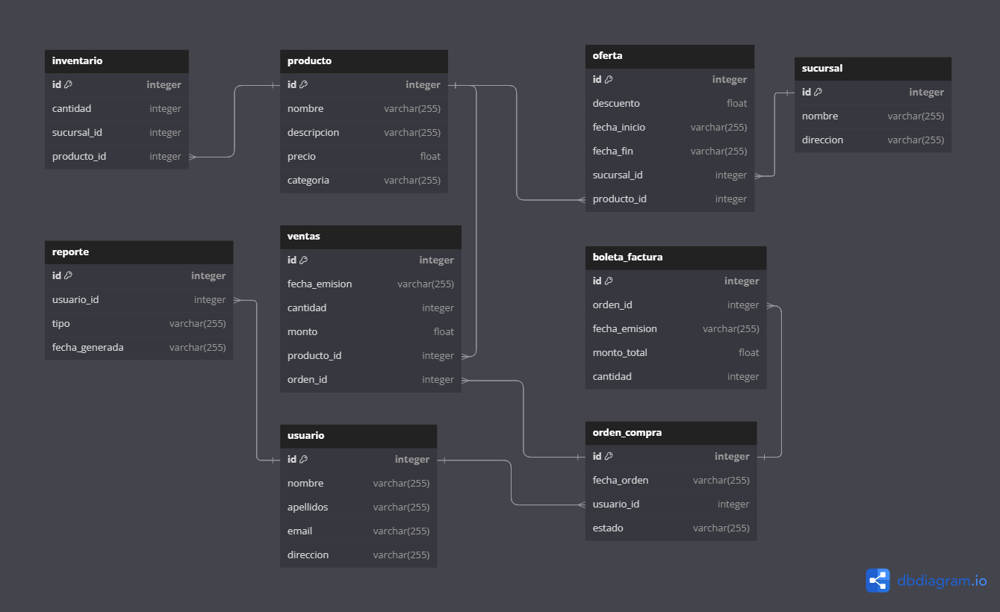

      


# Ferremas API

<p>
Ferremas API es una aplicación desarrollada con FastAPI que proporciona una solución completa para la gestión de una ferretería. La API permite la creación, actualización, visualización y eliminación de usuarios, productos, órdenes de compra, boletas/facturas, inventarios, ofertas, ventas, entre otros. La autenticación se maneja mediante tokens JWT y el esquema de autenticación Bearer.
</p>


## Características
- Usuarios: Crear, actualizar, mostrar y borrar usuarios.
- Productos: Crear, actualizar, mostrar y borrar productos.
- Órdenes de compra: Crear, actualizar, mostrar y borrar órdenes de compra.
- Boletas/Facturas: Crear, actualizar, mostrar y borrar boletas/facturas.
- Inventarios: Crear, actualizar, mostrar y borrar inventarios.
- Ofertas: Crear, actualizar, mostrar y borrar ofertas.
- Ventas: Crear, actualizar, mostrar y borrar ventas.


# Tecnologías Utilizadas
- FastAPI: Framework web moderno y de alto rendimiento para construir APIs con Python 3.7+.
- JWT (JSON Web Tokens): Para la autenticación y autorización segura.
- Bearer Token: Para la protección de rutas y servicios.

# Requisitos
- Python 3.7+
- FastAPI
- Uvicorn
- Pydantic
- SQLAlchemy 
- requeriments.txt

# Instalación
- Clona el repositorio:
``` 
git clone https://github.com/stephenlucic/ferremasfa.git
cd ferremasfa
```
- Crea un entorno virtual y activa:
```
python -m venv venv
venv\Scripts\activate # En MacOs usa `source env/bin/activate` 
```
- Instala las dependencias:
`pip install -r requeriments.txt`

- Configura las variables de entorno necesarias (e.g., configuración de la base de datos, claves secretas para JWT, etc.)

- Inicia el servidor:
`uvicorn app.main:app --reload`

# Uso
<p>
Una vez que el servidor está en funcionamiento, puedes acceder a la documentación interactiva de la API proporcionada por Swagger en http://127.0.0.1:8000/docs o la documentación en formato ReDoc en http://127.0.0.1:8000/redoc.
</p>

### Ejemplos de Endpoints

#### Usuarios

- POST /ususario/: Crear un nuevo usuario.
- GET /ususario/{id}/: Obtener detalles de un usuario.
- PUT /ususario/{id}/: Actualizar un usuario.
- DELETE /ususario/{id}/: Eliminar un usuario.

#### Productos

- POST /productos/: Crear un nuevo producto.
- GET /productos/{id}/: Obtener detalles de un producto.
- PUT /productos/{id}/: Actualizar un producto.
- DELETE /productos/{id}/: Eliminar un producto.

#### Órdenes de Compra

- POST /orden/: Crear una nueva orden de compra.
- GET /orden/{id}/: Obtener detalles de una orden de compra.
- PUT /orden/{id}/: Actualizar una orden de compra.
- DELETE /orden/{id}/: Eliminar una orden de compra.

### Autenticación

- POST /token: Obtener un token JWT para autenticación.

# Base de datos



# Grupo
- Carla Adasme
- Evelyn Soto
- Lucas Fuenzalida
- Stephen Lucic

### Profesora: Ana Karina Villagran
